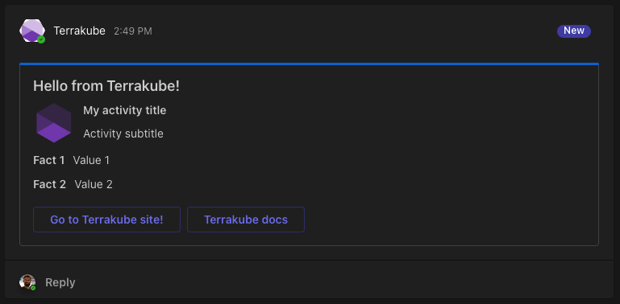

# Microsoft Teams Extension

This extension allows you to send [messages](https://learn.microsoft.com/en-us/outlook/actionable-messages/message-card-reference) to Microsoft Teams using the [Incoming Webhook](https://docs.microsoft.com/en-us/microsoftteams/platform/webhooks-and-connectors/how-to/connectors-using) connector.

## Example of simple notification

```yaml
flow:
- type: "customScripts"
  step: 100
  commands:
  - runtime: "GROOVY"
    priority: 100
    after: true
    script: |
      import MicrosoftTeams
      import MessageCard

      MessageCard message = new MessageCard('0078D7', 'Hello from Terrakube!', 'Hello Terrakube!')

      // Optionally you can add more info to the message
      message
        .setActivity('My activity title', 'Activity subtitle')
        .setButtons([
          'Go to Terrakube site!': 'https://www.terrakube.org',
          'terrakube docs': 'https://docs.terrakube.org'
        ])
        .setFacts([
          'Fact 1': 'Value 1',
          'Fact 2': 'Value 2'
        ])

      // You must set the MSTEAMS_WEBHOOK_URL with the actual webhook as an environment variable on your workspace or globally
      new MicrosoftTeams("$MSTEAMS_WEBHOOK_URL").sendMessage(message);
      "Teams Message Completed..."
```

The template above will generate a message like this:


