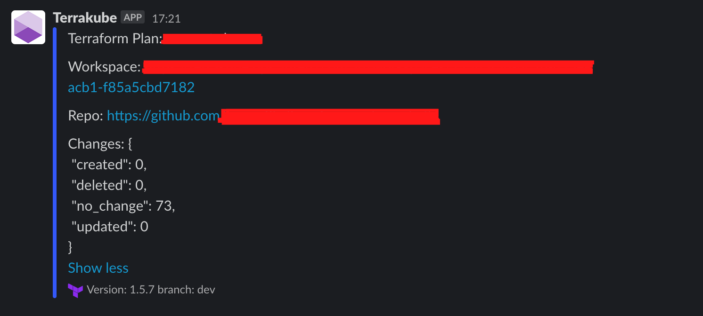

# Slack Extension

[Slack](https://slack.dev/java-slack-sdk/) is an online messaging app.

# Example simple notification:
```yaml
flow:
  - type: "customScripts"
    step: 100
    commands:
      - runtime: "GROOVY"
        priority: 100
        after: true
        script: |
          import SlackApp

          new SlackApp().sendMessageWithoutAttachment(
              "#general", 
              "Hello Terrakube!", 
              "$SLACK_TOKEN", 
              terrakubeOutput);
          "Slack Message Completed..."

```

> ***$SLACK_TOKEN*** is an environment variable define at workspace level, ***terrakubeOutput*** is the terrakube job output variable.

# Example nested notification:
```yaml
flow:
  - type: "customScripts"
    step: 100
    commands:
      - runtime: "GROOVY"
        priority: 100
        after: true
        script: |
          import SlackApp

          SlackApp slackApp = new SlackApp("$workingDirectory")
          
          slackApp.sendMessageWithoutAttachment(
              "#general", 
              "Hello Terrakube!", 
              "$SLACK_TOKEN", 
              terrakubeOutput);
          "Slack Message Completed..."
      - runtime: "GROOVY"
        priority: 200
        after: true
        script: |
          import SlackApp

          SlackApp slackApp = new SlackApp("$workingDirectory")
          
          slackApp.sendMessageWithoutAttachment(
              "#general", 
              "First reply to message!", 
              "$SLACK_TOKEN", 
              terrakubeOutput);

          slackApp.sendMessageWithoutAttachment(
              "#general", 
              "First reply to message!", 
              "$SLACK_TOKEN", 
              terrakubeOutput);
```

[Slack](https://slack.dev/java-slack-sdk/) is an online messaging app.

# Example Slack notification with attachment:
```yaml
flow:
  - type: "terraformPlan"
    step: 100
    name: "Running Terraform Plan with Drift Detection and Slack Notification"
    commands:
      - runtime: "GROOVY"
        priority: 100
        after: true
        script: |
          import Opa

          new Opa().loadTool(
            "$workingDirectory",
            "$bashToolsDirectory",
            "0.45.0")
          "Opa Download Completed..."
      - runtime: "BASH"
        priority: 200
        after: true
        script: |
          cd $workingDirectory;
          terraform show -json terraformLibrary.tfPlan > tfplan.json;
          echo "Validating terraform plan information";
          opa exec --decision terrakube/plan/information --bundle .terrakube/toolsRepository/policy/ tfplan.json | jq '.result[0].result' > drift_detection.json;
          cat drift_detection.json;
      - runtime: "GROOVY"
        priority: 300
        after: true
        script: |
          @Grapes([
            @Grab('com.slack.api:slack-api-client:1.21.2')
          ])
          import SlackApp
          import groovy.json.JsonSlurper
          import groovy.json.JsonOutput
          import com.slack.api.model.Attachment;
          
          File drift_detection = new File("${workingDirectory}/drift_detection.json")
          String drift_detection_content = drift_detection.text

          println drift_detection_content

          def jsonSlurper = new JsonSlurper()
          def body = jsonSlurper.parseText(drift_detection_content)
          def changes =  body.created + body.updated + body.deleted

          Attachment attachment = Attachment.builder()
            .text("Terraform Plan \n\nWorkspace: <your domain>/workspaces/$workspaceId \n\nRepo: $source \n\nChanges: $drift_detection_content")
            .footer("Version: $terraformVersion branch: $branch")
            .color("#1463fb")
            .build();

          new SlackApp().sendMessage(
            "#terraform_actions", 
            null,
            "$SLACK_TOKEN",
            Arrays.asList(attachment),
            terrakubeOutput
          );

          "Drift Detection Completed..."
```

## Example ScreenShot


> ***$SLACK_TOKEN*** is an environment variable define at workspace level, ***terrakubeOutput*** is the terrakube job output variable.
